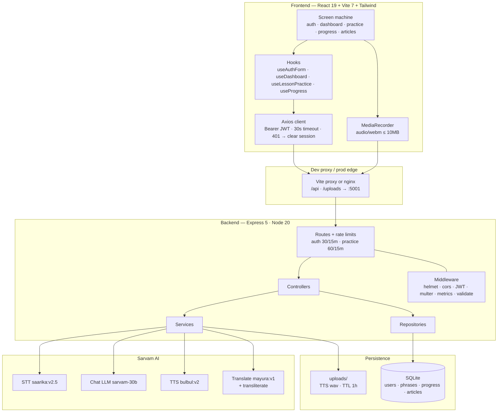
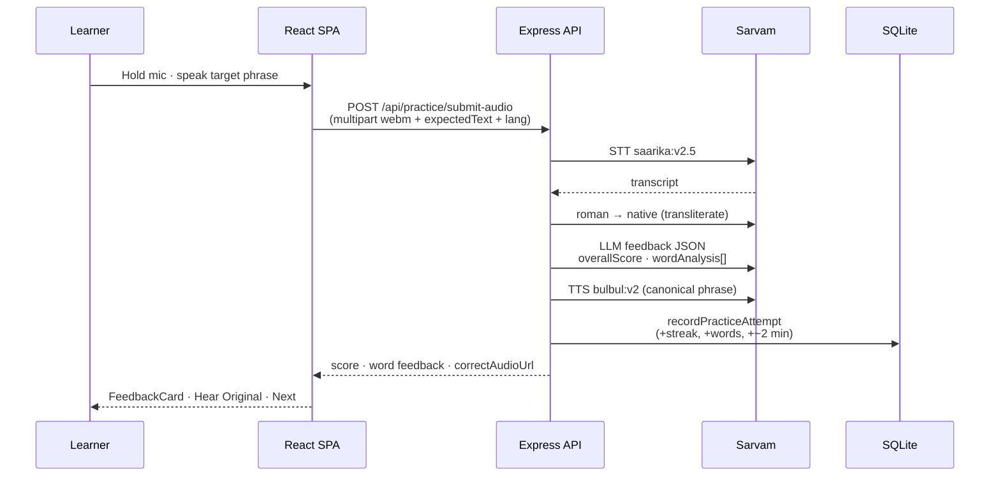

# Bhasha Salahakar

**Speech-first, gamified language learning for India’s internal migrants** — helping Hindi/Marathi speakers acquire everyday Kannada, Tamil, and Telugu so they can navigate work and life in southern IT hubs (Bengaluru, Hyderabad, Chennai, and beyond).

> *Bhasha* (भाषा) = language · *Salahakar* (सलाहकार) = advisor / guide

---

## Motivation

India’s internal migration corridor — especially North → South into tech and industrial cities — creates a **daily communication gap**: workers fluent in Hindi or Marathi arrive in Kannada-, Tamil-, or Telugu-speaking environments and must handle auto rides, hospitals, rent, banking, and workplaces without shared vocabulary.

Most language apps optimize for tourist phrases or exam grammar. **Bhasha Salahakar** is built around **migrant-worker situational phrases**, **pronunciation-first practice** (record → STT → LLM scoring → TTS correction), and light **gamification** (streaks, daily goals, locked curriculum) so learners build usable spoken fluency under real constraints: low time, high stakes, mobile-first.

---

## What it does

| Capability | Detail |
|------------|--------|
| **Curriculum** | **19** situational lesson categories (greetings → grocery → auto/cab → hospital → police → banking → workplace, …) |
| **Content** | **~188** migrant-worker daily phrases × **6** languages (`en`, `hi`, `kn`, `ta`, `te`, `mr`) via romanized + native script |
| **Pronunciation loop** | Browser `MediaRecorder` → Sarvam **STT** (`saarika:v2.5`) → LLM word-level feedback (`sarvam-30b`) → **TTS** (`bulbul:v2`) of the correct form |
| **Progress** | Day streak, today’s minutes goal (default **15**), weekly activity chart, skill bars (pronunciation / vocabulary / listening), sequential lesson unlocks |
| **Culture layer** | **12** South-India heritage articles seeded from **~55** curated sources; on-demand translation + script transliteration with DB cache |
| **Auth** | JWT (**7d**), bcrypt (**cost 10**), language-pair preferences (`native` ↔ `learning`) |

**Default pair:** Hindi (`hi`) → Kannada (`kn`) — the highest-volume North→Bengaluru corridor.

---

## Architecture

The system is a **React SPA** talking to an **Express API** that orchestrates **Sarvam AI** multimodal speech/LLM services and persists learners in **SQLite**.



### Request path (pronunciation attempt)



### Layering (backend)

```
server.js
 ├─ routes/          HTTP wiring, auth gates, validators, rate limits
 ├─ controllers/     Orchestration (practice pipeline lives here)
 ├─ services/        Sarvam STT · TTS · feedback · translation · metrics
 ├─ repositories/    SQL access (users, phrases, progress, articles)
 ├─ middleware/      JWT, multer, helmet/cors, metrics, errors
 └─ config/          env validation, SQLite bootstrap from schema.sql
```

**Reliability choices**
- Practice steps are **independently fault-tolerant**: STT / LLM / TTS failures surface as `warnings` instead of hard 500s; scoring falls back to **character-similarity** if the LLM JSON parse fails (with one strict retry).
- Article translations are **cached** in `article_translations` after the first Sarvam call.
- Generated TTS files under `/uploads` are purged after **1 hour**.
- Graceful shutdown closes HTTP then SQLite on `SIGTERM`/`SIGINT`.
- In-memory **`GET /metrics`**: request count, error rate, avg latency, Sarvam call latency.

---

## Tech stack

| Layer | Choices |
|-------|---------|
| **Frontend** | React **19.2**, Vite **7.2**, Tailwind **3.3**, Axios, Lucide; fonts: Outfit + Noto Sans (Devanagari / Tamil / Telugu / Kannada) |
| **Backend** | Node **20**, Express **5**, SQLite3, JWT, bcryptjs, multer, express-validator, express-rate-limit, helmet, cors, morgan |
| **AI** | [Sarvam AI](https://www.sarvam.ai/) — STT / TTS / LLM / translate / transliterate (Indic-first) |
| **Deploy** | Frontend: S3 + CloudFront (`deploy/frontend-deploy.sh`). Backend: EC2 + nginx + pm2 (`Bhasha-Salahakar-Backend/deploy/`) |

> Backend lives in a sibling repo: [`Bhasha-Salahakar-Backend`](./Bhasha-Salahakar-Backend) (or its own GitHub remote). The SPA proxies `/api` and `/uploads` to `localhost:5001` in development.

---

## Gamified learning model

Not XP/badge theater — **habit + unlock** mechanics tied to practice volume:

| Mechanic | Implementation |
|----------|----------------|
| **Day streak** | Updated on each scored practice attempt (`user_progress.current_streak`) |
| **Daily goal** | Progress toward `todayGoalMinutes` (default **15**); ~**2 minutes** credited per attempt |
| **Weekly chart** | Minutes / attempts aggregated per weekday |
| **Skill bars** | Derived pronunciation / vocabulary / listening percentages on Progress screen |
| **Curriculum locks** | Category index `i` unlocks when `lessonsCompleted >= i` (first lesson always open) |
| **Lesson complete** | Finishing the last phrase in a category → `POST /progress/complete-lesson` |

Categories mirror real migrant tasks: `auto-cab-communication`, `hospital-emergency`, `renting-accommodation`, `banking-money-transfer`, `workplace-construction`, etc.

---

## Data model (SQLite)

```
users 1──1 user_progress
  ├──* practice_attempts
  └──* lesson_completions *──1 categories 1──* phrases 1──* phrase_translations

articles *──* article_sources
articles 1──* article_translations   (lang + script cache)
```

Seeded from CSV:
- `migrant_worker_daily_phrases_v2_1.csv` → **19** categories, **188** phrases
- `south_india_heritage_sources.csv` → **~55** sources → **12** articles

---

## API surface

| Prefix | Auth | Notes |
|--------|------|-------|
| `POST /api/auth/{signup,login,reset-password}` | Public (rate-limited) | JWT issued on login |
| `GET /api/auth/me` · `PATCH /api/auth/languages` | JWT | Preference pair |
| `GET /api/lessons/categories` | JWT | Lock metadata for UI |
| `GET /api/lessons/:native-:learning/phrases?category=` | JWT | Phrase pack for a lesson |
| `POST /api/practice/submit-audio` | JWT + 60/15m | Full STT→LLM→TTS pipeline |
| `GET /api/practice/tts` | JWT | Preview correct pronunciation |
| `GET /api/progress` · `POST /api/progress/complete-lesson` | JWT | Streak / goals / unlocks |
| `GET /api/articles` · `GET /api/articles/:id` | JWT | Heritage + cached translation |
| `GET /health` · `GET /metrics` | Public | Ops |

---

## Repository layout

```
Bhasha-Salahakar/                 # this repo — frontend
├── src/
│   ├── App.jsx                   # screen-state router
│   ├── components/               # Dashboard, LessonPractice, FeedbackCard, …
│   ├── hooks/                    # auth · dashboard · practice · progress
│   ├── services/api/             # axios wrappers
│   └── constants/                # languages, categories, UI strings
├── deploy/frontend-deploy.sh     # S3 + CloudFront
└── Bhasha-Salahakar-Backend/     # API (separate git remote recommended)
    ├── server.js
    ├── database/schema.sql
    ├── scripts/seed-*.js
    └── src/{routes,controllers,services,repositories,middleware}/
```

---

## Quick start

### Prerequisites
- Node.js **20+**
- Sarvam API key ([Sarvam console](https://www.sarvam.ai/))

### 1. Backend (`:5001`)

```bash
cd Bhasha-Salahakar-Backend
cp .env.example .env          # set JWT_SECRET + SARVAM_API_KEY
npm install
npm run seed                  # load phrases + articles (~188 + 12)
npm run dev                   # nodemon server.js
```

### 2. Frontend (`:5173`)

```bash
cd ..                         # repo root
cp .env.example .env          # VITE_API_BASE_URL=/api
npm install
npm run dev
```

Open **http://localhost:5173**. Vite proxies `/api` and `/uploads` → `http://localhost:5001`.

---

## Design principles (engineering)

1. **Speech is the unit of learning** — text is scaffolding; the graded artifact is audio.
2. **Indic-first models** — Sarvam over generic EN-centric STT/TTS for `hi/kn/ta/te/mr`.
3. **Degrade, don’t die** — multimodal pipelines fail open with fallbacks so a flaky STT call still yields a practice attempt.
4. **Curriculum = real life** — phrase taxonomy follows migrant daily paths, not CEFR tourist lists.
5. **Thin client, thick practice path** — SPA owns UX/session; scoring, speech, and progress live on the server for consistency and key safety.

---

## Status & scope

Built as a full-stack product prototype suitable for demo, resume, and research statement discussion: end-to-end auth, seeded domain content, multimodal pronunciation feedback, progress persistence, and deploy scripts for S3/CloudFront + EC2/nginx/pm2.

**Intentionally out of scope (for now):** email-token password reset, multi-instance SQLite HA, offline-first PWA, A/B experiment framework.

---

## License

Private / educational project — contact the author for reuse.
